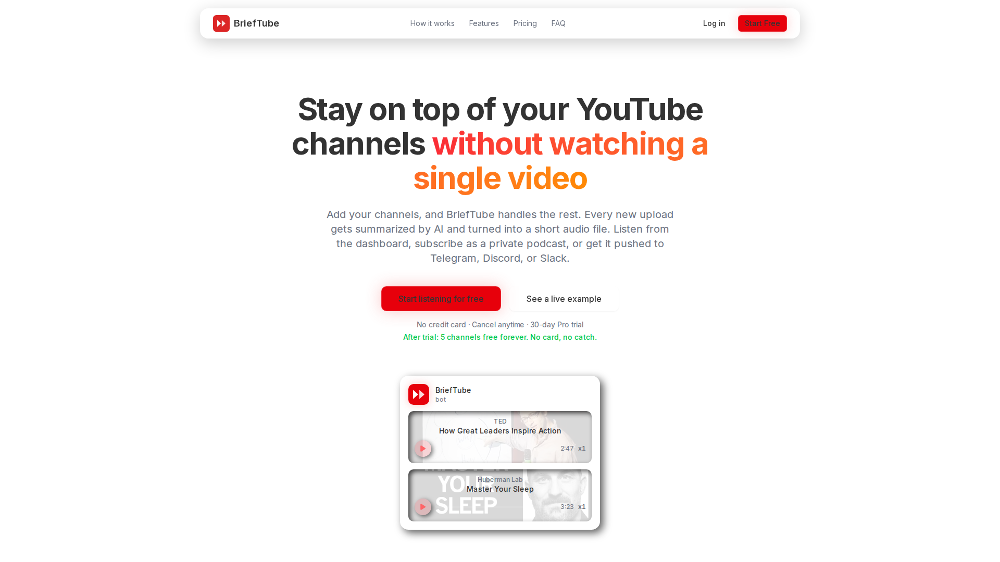

<p align="center">
  
</p>

<h1 align="center">BriefTube</h1>

<p align="center">
  <b>Follow YouTube channels without watching them.</b><br />
  Every new upload gets summarized, turned into audio, and pushed to you.
</p>

<p align="center">
  <a href="https://github.com/Topxl/BriefTube/blob/main/LICENSE"></a>
  &nbsp;
  <a href="https://github.com/Topxl/BriefTube/stargazers"></a>
  &nbsp;
  
  &nbsp;
  
</p>

<p align="center">
  <a href="#quick-start-docker">Self-host</a> ·
  <a href="#how-it-works">How it works</a> ·
  <a href="#configuration">Configuration</a> ·
  <a href="https://www.brief-tube.com">Hosted version</a>
</p>

---

<p align="center">
  
</p>

## What it does

You subscribe to a YouTube channel. From then on, every video it publishes is:

1. **Detected** within minutes, over RSS. No YouTube API quota, no polling cost.
2. **Transcribed**, through a five-source cascade that falls back to Whisper only when everything free has failed.
3. **Summarized** by Gemini, in the language _you_ picked, at the length and style you picked.
4. **Voiced** with neural TTS into a 2 to 4 minute audio file.
5. **Delivered** to Telegram, Slack, Discord, Notion, WhatsApp, a private podcast feed, or the web dashboard.

The result is a podcast of the videos you never had time to watch.

## Why this exists

Summarizing a single video is a solved problem — NotebookLM and Gemini do it for free.

What nobody does for free is the _standing subscription_: pick 20 channels once, then never think about it again, and get audio in your ears while you commute. That is the whole point of this codebase, and it is why the interesting parts are the RSS scanner, the transcript cascade, and the delivery queue rather than the LLM call.

## Features

|                        |                                                                                                                                                     |
| ---------------------- | --------------------------------------------------------------------------------------------------------------------------------------------------- |
| **Transcript cascade** | `youtube-transcript-api` → Invidious → Piped → `yt-dlp` → Whisper. Each step is free until the last one. Cost per video is logged.                  |
| **15 languages**       | Summarize a Japanese video into French. Source language is detected, target is your choice.                                                         |
| **Tunable summaries**  | Length (brief / standard / detailed / auto), style (key points / actionable / narrative), plus free-form instructions. Set globally or per channel. |
| **6 delivery targets** | Telegram (voice notes), Slack, Discord, Notion, WhatsApp, private RSS podcast feed.                                                                 |
| **Music filtering**    | Detects music videos with no speech and skips them instead of burning Whisper minutes.                                                              |
| **Runs on a Pi**       | The worker is designed for a Raspberry Pi 4. Whisper is offloaded to [Modal](https://modal.com) so the Pi never does heavy compute.                 |
| **Browser extension**  | Send any video to your queue from the YouTube page.                                                                                                 |
| **AI support agent**   | An in-app assistant answering from a self-managed knowledge base, escalating to email when it cannot.                                               |

## Quick start (Docker)

**Prerequisites:** Docker, a free [Supabase](https://supabase.com) project, a [Telegram bot token](https://t.me/BotFather), and a [Gemini API key](https://aistudio.google.com/apikey). Budget 10 minutes.

```bash
git clone https://github.com/Topxl/BriefTube.git
cd BriefTube
./scripts/setup.sh
```

The script copies `.env.example` to `.env` and walks you through what to fill in. Then apply the database schema — **one file**, pasted into the Supabase SQL Editor:

```
migrations/00000000_initial_schema.sql
```

Then bring it up:

```bash
docker compose up -d
```

The dashboard is on `http://localhost:3000`, the worker health endpoint on `http://localhost:8080/health`.

Only three services are actually required: **Supabase**, **Gemini**, and **Telegram**. Stripe, Resend, Sentry, PostHog, Slack, Discord, Notion and WhatsApp are all optional — leave them blank and the matching features simply switch off.

> **Note on Supabase.** BriefTube does not bundle its own database. It relies on Supabase for Postgres, auth, row-level security and file storage. The free tier is enough for personal use. See [`migrations/README.md`](migrations/README.md).

## How it works

```
                    ┌──────────────────────────────────────────┐
                    │  Next.js dashboard (web)                  │
                    │  subscriptions · settings · audio player  │
                    └────────────────────┬─────────────────────┘
                                         │
                              ┌──────────▼──────────┐
                              │      Supabase       │
                              │  Postgres + Auth +  │
                              │   Storage + RLS     │
                              └──────────▲──────────┘
                                         │
   ┌─────────────────────────────────────┴─────────────────────────────────────┐
   │  Python worker — three independent async loops                            │
   │                                                                            │
   │   1. RSS scanner ──► new video found ──► processing_queue                  │
   │                                                                            │
   │   2. Processor   ──► transcript cascade ──► Gemini summary ──► TTS         │
   │                      (yt-api → Invidious → Piped → yt-dlp → Whisper)       │
   │                                                                            │
   │   3. Deliverer   ──► Telegram · Slack · Discord · Notion · WhatsApp · RSS  │
   └────────────────────────────────────────────────────────────────────────────┘
```

The three loops are decoupled through the database, so a failing delivery never blocks a summary and a Gemini outage never loses a video. Jobs get 3 attempts; deterministic failures (transcripts disabled, video unavailable, music with no speech) fail immediately instead of retrying forever, and temporary ones (premieres, live streams, rate limits) are snoozed.

## Tech stack

**Web** — Next.js 16 (App Router), TypeScript strict, TailwindCSS v4, Shadcn/UI, TanStack Query + Form, nuqs, Stripe, React Email + Resend.

**Worker** — Python 3.12, asyncio, `python-telegram-bot`, `yt-dlp`, Edge TTS / Kokoro, Modal for GPU offload.

**Data** — Supabase (Postgres 17, Auth, Storage, Realtime). 33 tables, RLS on every one of them.

**AI** — Gemini 2.5 Flash for summaries, with OpenRouter as fallback. Groq or Modal Whisper for transcription of last resort.

## Project structure

```
app/                Next.js App Router pages
  dashboard/        User dashboard
  dashboard/admin/  Admin panel
  api/              API routes
src/
  components/       UI components (ui/ = Shadcn, nowts/ = custom)
  features/         Feature-scoped logic
  lib/              Supabase, auth, Stripe, rate limiting
worker/             Python worker
  main.py           Three async loops + health HTTP server
  transcript_*.py   Transcript cascade
  *_deliverer.py    One file per delivery platform
  db.py / db_pg.py  Supabase REST client and direct psycopg2 client
migrations/         Database schema (start with 00000000_initial_schema.sql)
extension/          Browser extension
```

## Configuration

Every variable is documented inline in [`.env.example`](.env.example), marked `REQUIRED` or `OPTIONAL`, with a link to the console where you get it.

## Contributing

Read [`CONTRIBUTING.md`](CONTRIBUTING.md) first. Two things matter:

- Run `pnpm clean` before opening a pull request (lint, typecheck, format).
- Add a line to `CHANGELOG.md`. This one is strictly enforced.

## Project status

**Maintained casually.** The hosted service at [brief-tube.com](https://www.brief-tube.com) stays online and I keep the worker healthy, but I am not actively building new features.

Pull requests are welcome and I will review them. Issues may sit for a while. If you need this to move in a particular direction, forking is a perfectly good answer — that is what the license is for.

## Hosted version

[brief-tube.com](https://www.brief-tube.com) runs this exact codebase. Paying for it buys you the not-running-it, not the software: managed infrastructure, a shared Telegram bot, and API keys you do not have to obtain yourself. Self-hosting gives you every feature.

## License

[AGPL-3.0](LICENSE). You can run it, modify it, and host it for yourself or others. If you offer it as a network service, you have to publish your changes.
